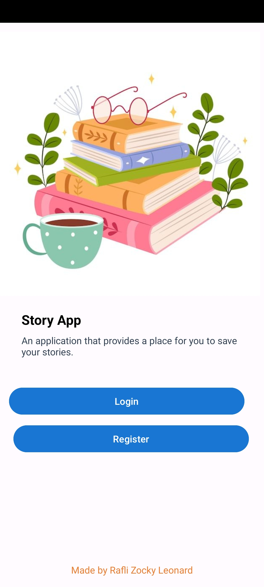
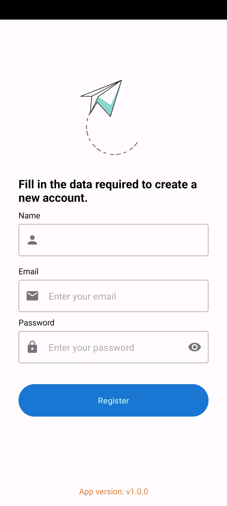
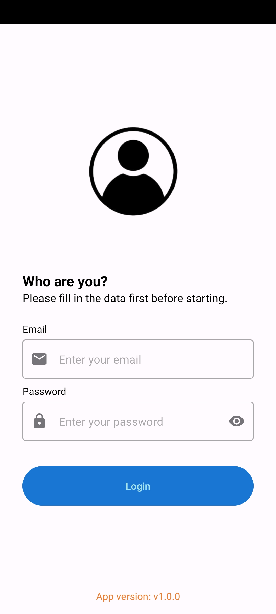
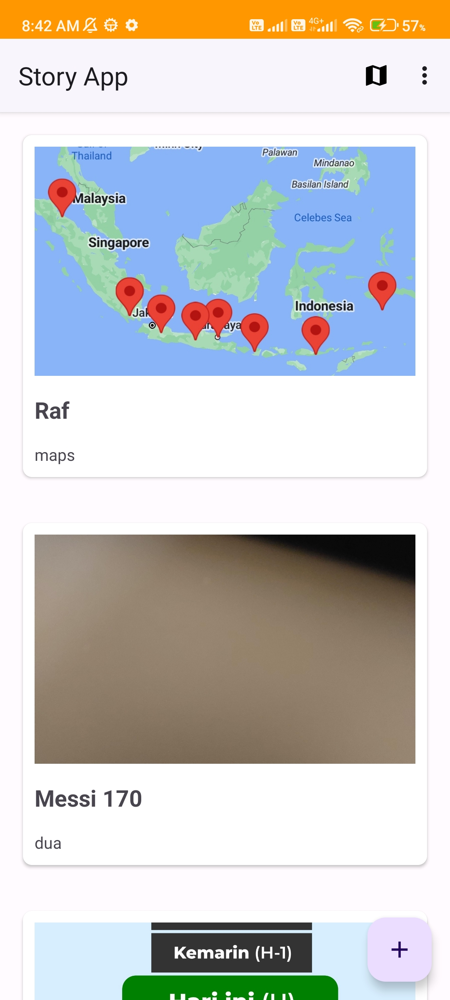
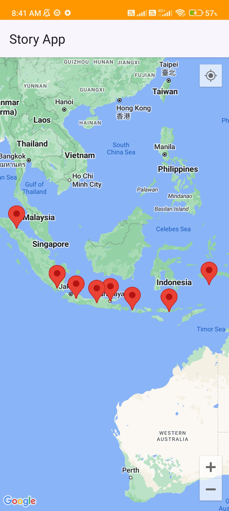
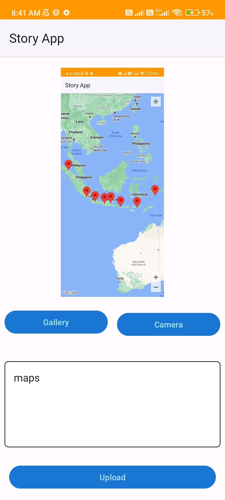
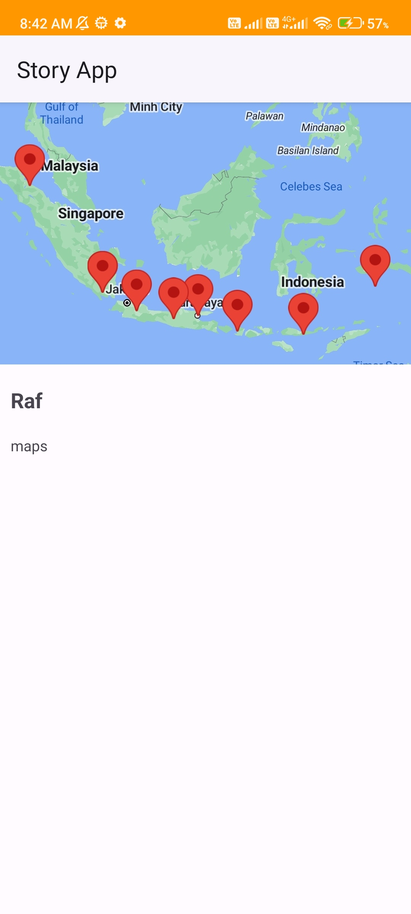

# StoryApp

StoryApp is an Android application designed for users to store and share their stories using the [Dicoding Story REST API](https://story-api.dicoding.dev/v1/). It incorporates features such as user login and registration, adding personal stories, and displaying the locations on maps where others have uploaded their stories. The app is built using intermediate/advanced Android components and libraries, including animations, geolocation, and media functionalities. For a comprehensive understanding of the components and libraries used, refer to the code.

---

## Installation
Download and install beta version [here](https://github.com/raflizocky/StoryApp/releases/download/v1.0-beta/app-debug.apk)

---

## Demo    
<h3 align="center"> Light Mode </h3>

    
    
    
    
    
    
      
   

<h3 align="center"> Dark Mode </h3>

   soon

## Pull Requests
Feel free to contribute to this repository by creating pull requests to add new features or demonstrate library usage.

## Support Me
> Just **star** or **fork** this repository and follow my GitHub. Your support means a lot!
